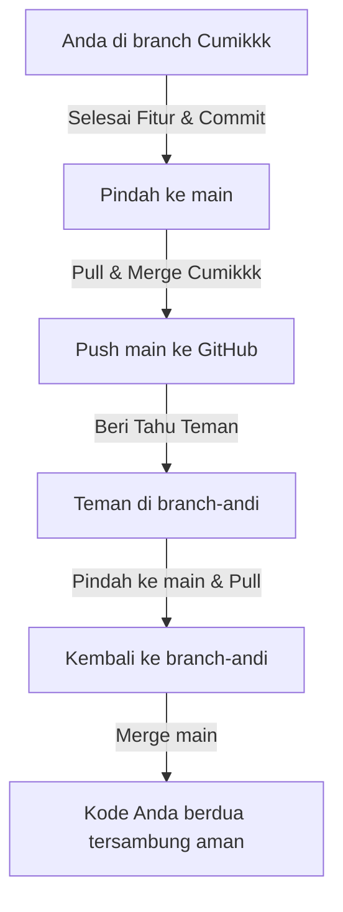

# 📋 Panduan Alur Perintah Git

Berikut adalah urutan perintah Git yang rapi dan siap digunakan untuk alur kerja harian maupun kolaborasi bersama tim Anda:

---

## 🌿 A. Alur Kerja Harian di Branch Sendiri (`Cumikkk`)

Jalankan urutan 5 langkah ini setiap kali Anda ingin bekerja dan menyimpan hasil kerja Anda ke branch `Cumikkk`:

1. **Cek Posisi Branch** (Pastikan tertulis `* Cumikkk` di terminal)
   ```bash
   git branch
   ```
   *(Jika Anda berada di branch `main`, ketik `git checkout Cumikkk` dahulu)*

2. **Tarik Pembaruan Online Terbaru** (Untuk sinkronisasi dengan GitHub)
   ```bash
   git pull
   ```

3. **Tandai Semua Perubahan File**
   ```bash
   git add .
   ```

4. **Kunci Perubahan di Lokal**
   ```bash
   git commit -m "Deskripsi singkat hasil kerja Anda"
   ```

5. **Kirim Perubahan ke GitHub**
   ```bash
   git push origin Cumikkk
   ```

---

## 👥 B. Alur Kerja Kolaborasi Bersama Teman (Kerja Bareng)

Bagian ini menjelaskan bagaimana Anda (`Cumikkk`) dan teman Anda (misalnya branch `branch-andi`) bekerja bersama tanpa mengganggu branch utama (`main`).



### 1. Perintah yang Dilakukan oleh TEMAN Anda:
Teman Anda membuat branch kerjanya sendiri untuk mulai menulis fiturnya:
```bash
# Membuat & pindah ke branch baru milik teman
git checkout -b branch-andi

# Setelah selesai coding, tandai & commit perubahan
git add .
git commit -m "Deskripsi hasil kerja teman"

# Upload branch teman ke GitHub (Push Pertama)
git push -u origin branch-andi
```

### 2. Perintah untuk Menyatukan Hasil Kerja Anda ke Branch Utama (`main`):
Jika fitur Anda di branch `Cumikkk` sudah selesai dan ingin dibagikan ke teman Anda, lakukan ini:
```bash
# 1. Pindah ke branch main
git checkout main

# 2. Ambil update terbaru dari GitHub main
git pull

# 3. Gabungkan kode Cumikkk ke dalam main
git merge Cumikkk

# 4. Push hasil penggabungan ke GitHub main
git push origin main
```

### 3. Perintah agar Teman Anda Bisa Mengambil Pembaruan dari `main`:
Teman Anda ingin memasukkan fitur baru buatan Anda tadi ke branch kerjanya (`branch-andi`):
```bash
# 1. Teman pindah ke branch main lokalnya
git checkout main

# 2. Teman menarik kode terbaru dari GitHub main
git pull

# 3. Teman kembali ke branch kerjanya
git checkout branch-andi

# 4. Teman menggabungkan kode main terbaru ke branch kerjanya
git merge main
```

---

## 🔄 C. Cara Mengambil Pembaruan dari Branch Teman
Jika Anda ingin melihat atau mengambil kode yang dikerjakan teman Anda di branch-nya (`branch-andi`) secara langsung:

1. **Ambil informasi branch baru dari GitHub**:
   ```bash
   git fetch origin
   ```

2. **Pindah ke branch teman Anda untuk melihat kodenya**:
   ```bash
   git checkout branch-andi
   ```

---

## ⏪ D. Pembatalan Perubahan (Jika Ada Salah Edit)

* **Membatalkan editan file yang BELUM di-`git add`:**
  ```bash
  git restore nama_file.php
  ```
* **Membatalkan file yang terlanjur di-`git add` (keluar dari antrean):**
  ```bash
  git restore --staged nama_file.php
  ```
* **Membatalkan commit terakhir di lokal (File editan Anda tetap aman):**
  ```bash
  git reset --soft HEAD~1
  ```
* **Membatalkan commit terakhir & MENGHAPUS semua editan file secara total:**
  ```bash
  git reset --hard HEAD~1
  ```